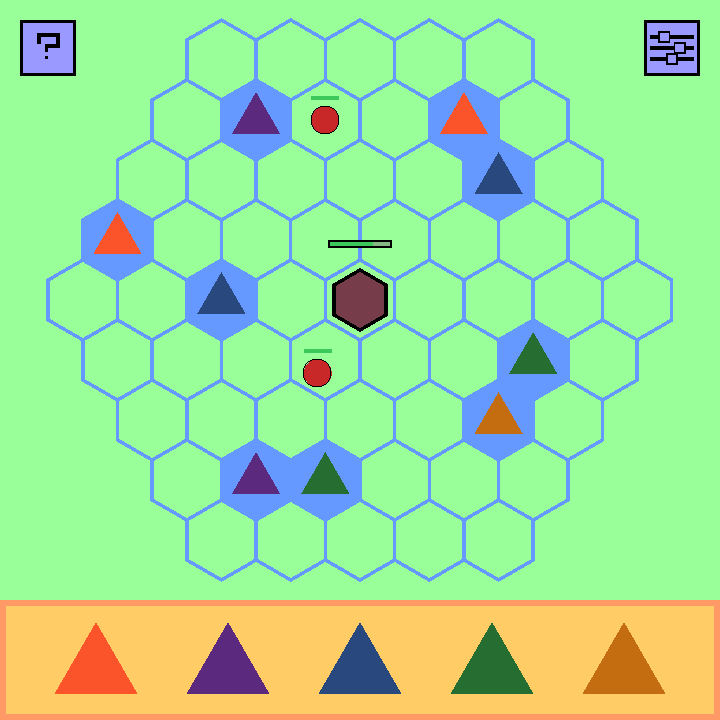
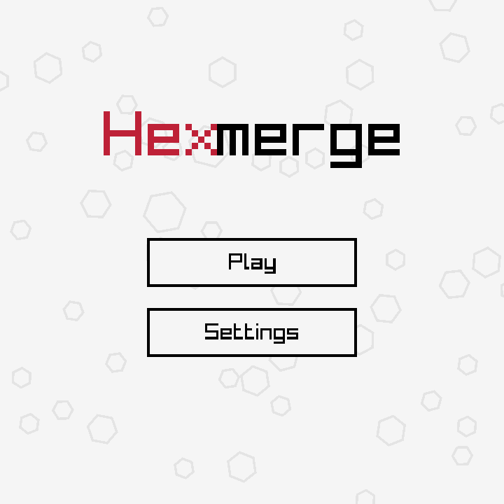
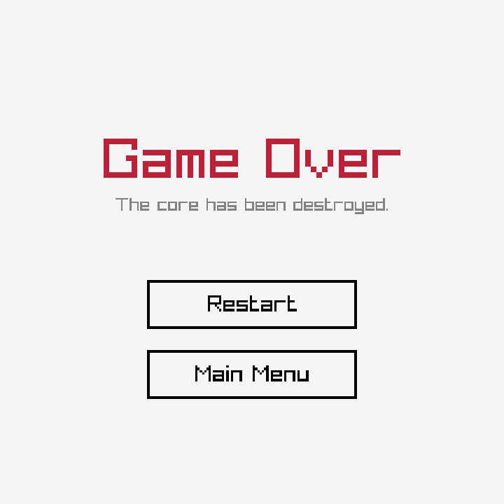

-----------------------------------

**Template by [@raysan5](https://github.com/raysan5): [raylib-gamejam-template](https://github.com/raysan5/raylib-gamejam-template)**

_Copyright (c) 2014-2026 Ramon Santamaria ([@raysan5](https://github.com/raysan5))_
-----------------------------------

## Hex Madness

### Description

Place and merge towers to protect your base against enemies!

### Features

 - Place towers on the grid
 - Merge towers by placing them next to each other
 - Upgrade your base to defend against enemies

### Controls

Keyboard:
 - $(Game Control 01)
 - $(Game Control 02)
 - $(Game Control 03)

### Screenshots

### Developers

 - [@Senievol](https://github.com/Senievol) - Programmer
 - [@karchakrok](https://github.com/karchakrok) - Programmer
 - [@Linkus-star](https://github.com/Linkus-star) - Sound / Graphics Designer

### Links

 - itch.io Release: $(itch.io Game Page)

### License

This project sources are licensed under an unmodified zlib/libpng license, which is an OSI-certified, BSD-like license that allows static linking with closed source software. Check [LICENSE](LICENSE) for further details.

*Copyright (c) 2026 Senievol (@Senievol)*
